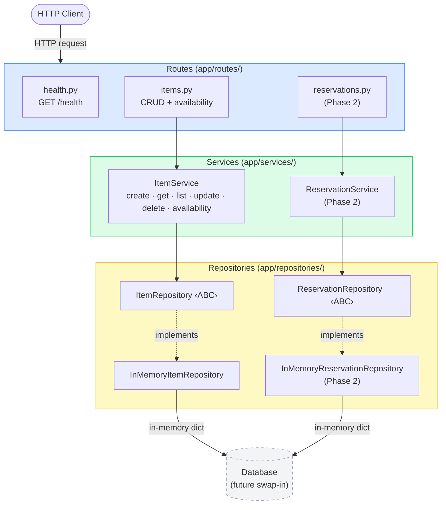
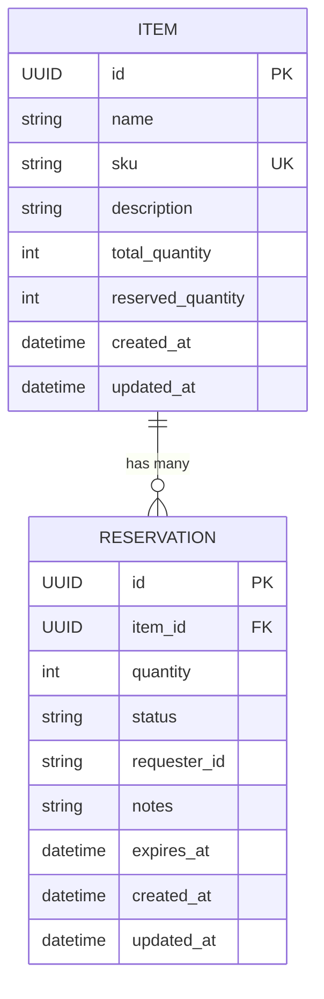

# Inventory Reservation System

A RESTful API for managing inventory and reservations, built with Python and FastAPI.

---

## Table of Contents

- [Task List](TASKS.md)
- [Phases](#phases)
- [Architecture](#architecture)
- [Getting Started](#getting-started)
- [Tech Stack](#tech-stack)
- [Project Structure](#project-structure)
- [How to Run](#how-to-run)
- [Clean Run Process](#clean-run-process)
- [API Reference](#api-reference)
- [Demo Script](#demo-script)

---

## Phases

| Phase | Status | Description |
|-------|--------|-------------|
| 1 | ✅ Complete | Project scaffold, Items CRUD, availability endpoint |
| 2 | 🔜 Pending | Reservations — create and query |
| 3 | 🔜 Pending | Reservation lifecycle — confirm, cancel, fulfill |
| 4 | 🔜 Pending | Filtering, pagination, expiry |

---

## Architecture

### Layer Diagram



### Layer Rules

| Layer | Allowed to call | Not allowed to call |
|-------|----------------|---------------------|
| Routes | Services only | Repositories, other Routes |
| Services | Repositories only | FastAPI (`Request`/`Response`), other Services |
| Repositories | Storage only | Services, Routes |

### Request Flow

```
HTTP Request
     │
     ▼
 [Routes]       Parse request body → call service → serialize response
     │
     ▼
 [Services]     Enforce business rules (availability, status transitions, duplicates)
     │
     ▼
 [Repositories] Read/write storage via ABC interface (swap in-memory → DB with zero service changes)
```

### Data Model Relationships



---

## Getting Started

**Prerequisites:** Python 3.9+

```bash
git clone https://github.com/Tejusc/Inventory-reservation.git
cd Inventory-reservation
python3 -m venv .venv
source .venv/bin/activate
pip install -r requirements.txt
```

---

## Tech Stack

| Layer | Technology |
|-------|-----------|
| Language | Python 3.9+ |
| Framework | FastAPI 0.111 |
| Validation | Pydantic v2 |
| Server | Uvicorn |
| Testing | pytest + httpx TestClient |
| Storage | In-memory (DB-ready repository interface) |

---

## Project Structure

```
app/
  main.py                         # FastAPI app factory
  models/
    enums.py                      # ReservationStatus enum
    item.py                       # Item domain model + request/response schemas
    reservation.py                # Reservation domain model + request/response schemas
  routes/
    health.py                     # GET /health
    items.py                      # Items CRUD routes
    reservations.py               # Reservations routes
  services/
    item_service.py               # Item business logic
    reservation_service.py        # Reservation business logic
  repositories/
    item_repository.py            # ItemRepository ABC
    reservation_repository.py     # ReservationRepository ABC
    in_memory/
      item_repo.py                # InMemoryItemRepository
      reservation_repo.py         # InMemoryReservationRepository
tests/
  conftest.py                     # Shared fixtures
  test_item_service.py            # Item service unit tests
  test_item_routes.py             # Item route integration tests
  test_reservation_service.py     # Reservation service unit tests
  test_reservation_routes.py      # Reservation route integration tests
requirements.txt
README.md
```

**Architecture rule:** Routes call services. Services call repositories. No layer skips another.

---

## How to Run

```bash
source .venv/bin/activate
uvicorn app.main:app --reload
```

API will be available at `http://127.0.0.1:8000`

Interactive docs: `http://127.0.0.1:8000/docs`

---

## Clean Run Process

```bash
# 1. Create a fresh virtual environment
python3 -m venv .venv
source .venv/bin/activate

# 2. Install dependencies
pip install -r requirements.txt

# 3. Run tests
pytest tests/ -v

# 4. Start the server
uvicorn app.main:app --reload
```

---

## API Reference

### Health

| Method | Path | Description | Response |
|--------|------|-------------|----------|
| GET | `/health` | Liveness check | `{"status": "ok"}` |

### Items

| Method | Path | Description | Status |
|--------|------|-------------|--------|
| POST | `/items` | Create a new item | 201 |
| GET | `/items` | List all items (paginated) | 200 |
| GET | `/items/{item_id}` | Get item by ID | 200 |
| PUT | `/items/{item_id}` | Update item fields | 200 |
| DELETE | `/items/{item_id}` | Delete an item | 204 |
| GET | `/items/{item_id}/availability` | Get stock availability | 200 |

#### Create Item — `POST /items`

**Request**
```json
{
  "name": "Widget",
  "sku": "WGT-001",
  "description": "A standard widget",
  "total_quantity": 100
}
```

**Response 201**
```json
{
  "id": "3fa85f64-5717-4562-b3fc-2c963f66afa6",
  "name": "Widget",
  "sku": "WGT-001",
  "description": "A standard widget",
  "total_quantity": 100,
  "reserved_quantity": 0,
  "available_quantity": 100,
  "created_at": "2026-05-25T10:00:00Z",
  "updated_at": "2026-05-25T10:00:00Z"
}
```

#### Get Availability — `GET /items/{item_id}/availability`

**Response 200**
```json
{
  "item_id": "3fa85f64-5717-4562-b3fc-2c963f66afa6",
  "total_quantity": 100,
  "reserved_quantity": 10,
  "available_quantity": 90
}
```

### Reservations

| Method | Path | Description | Status |
|--------|------|-------------|--------|
| POST | `/reservations` | Create a reservation | 201 |
| GET | `/reservations` | List reservations (filterable) | 200 |
| GET | `/reservations/{reservation_id}` | Get reservation by ID | 200 |

**Query parameters for `GET /reservations`:**

| Param | Type | Description |
|-------|------|-------------|
| `item_id` | UUID | Filter by item |
| `status` | string | Filter by status (`PENDING`, `CONFIRMED`, `CANCELLED`, `FULFILLED`) |
| `requester_id` | string | Filter by requester |
| `skip` | int | Pagination offset (default 0) |
| `limit` | int | Page size (default 100, max 500) |

#### Create Reservation — `POST /reservations`

**Request**
```json
{
  "item_id": "3fa85f64-5717-4562-b3fc-2c963f66afa6",
  "quantity": 10,
  "requester_id": "user-123",
  "notes": "Urgent order",
  "expires_at": "2026-06-01T00:00:00Z"
}
```

**Response 201**
```json
{
  "id": "a1b2c3d4-0000-0000-0000-000000000000",
  "item_id": "3fa85f64-5717-4562-b3fc-2c963f66afa6",
  "quantity": 10,
  "status": "PENDING",
  "requester_id": "user-123",
  "notes": "Urgent order",
  "expires_at": "2026-06-01T00:00:00Z",
  "created_at": "2026-05-25T10:00:00Z",
  "updated_at": "2026-05-25T10:00:00Z"
}
```

**Error responses:**
- `404` — item not found
- `409` — insufficient available quantity
- `422` — quantity < 1

---

## Demo Script

```bash
BASE=http://127.0.0.1:8000

# Health check
curl $BASE/health

# Create an item
curl -s -X POST $BASE/items \
  -H "Content-Type: application/json" \
  -d '{"name":"Widget","sku":"WGT-001","total_quantity":100}' | python3 -m json.tool

# List items
curl -s $BASE/items | python3 -m json.tool

# Get item by ID (replace <id> with the id from create response)
curl -s $BASE/items/<id> | python3 -m json.tool

# Check availability
curl -s $BASE/items/<id>/availability | python3 -m json.tool

# Update item
curl -s -X PUT $BASE/items/<id> \
  -H "Content-Type: application/json" \
  -d '{"total_quantity":200}' | python3 -m json.tool

# Delete item
curl -s -X DELETE $BASE/items/<id> -o /dev/null -w "%{http_code}\n"
```
